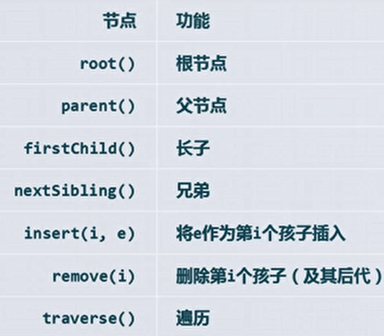
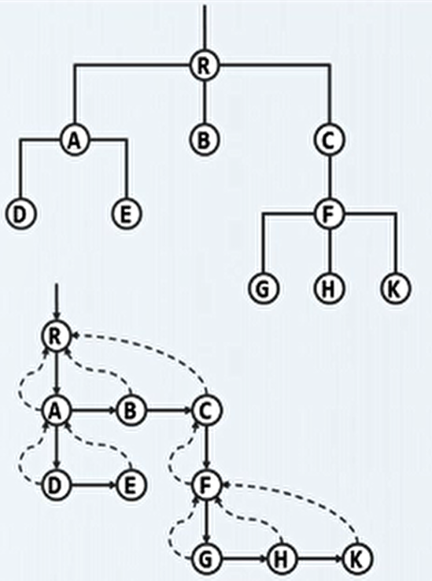
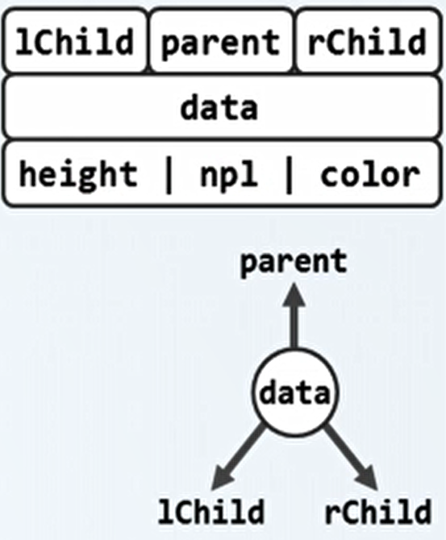
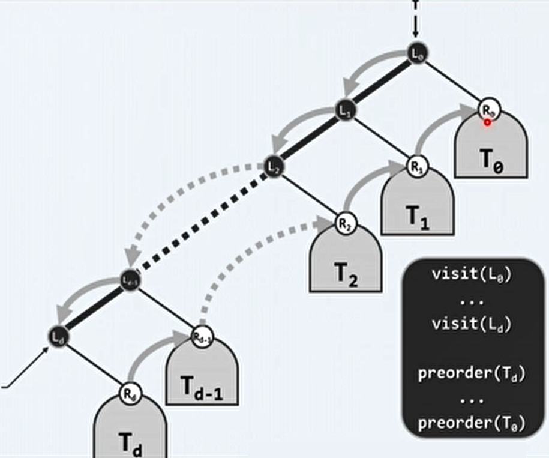
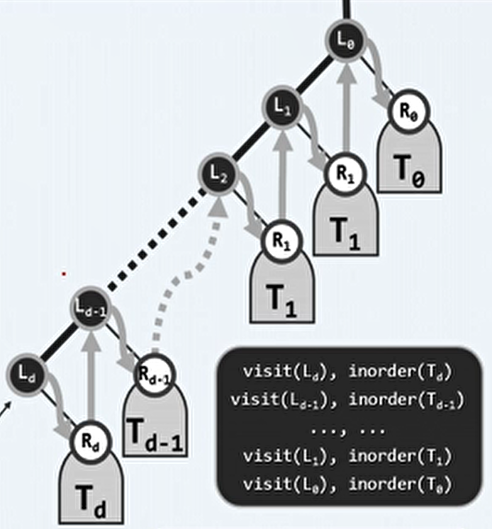
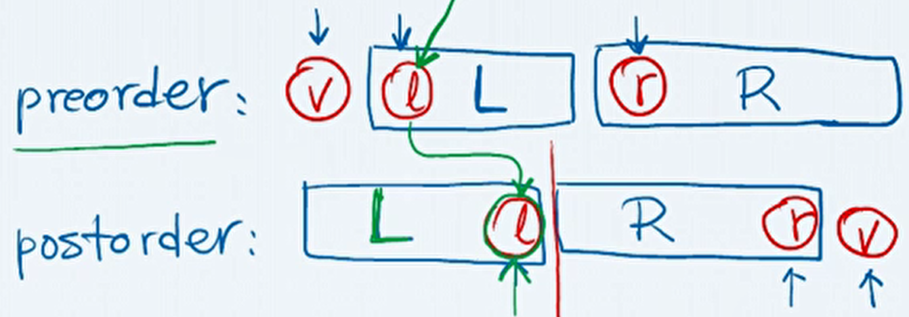

# 5、二叉树

 ## 1、树

- 向量和列表都无法兼顾静态（如寻找）和动态（如插入）操作。而树形结构可以一定程度上结合二者的优点，可以认为树是列表的列表，是一种半线性结构。

- 树结构的应用：层级结构表示，表达式、文件系统、URL。

- 树结构可以被看作是特殊的图结构 T = （V，E）。

- 有根树和有序树：
  - 指定任意节点 r ∈ V 作为根后，T 则称为有根树。顶点 V（vertex），边 E （edge）。
  - 为多个有根树 ri ，指定一个共同的根 r ，则构成了一个新的有根树。各个 ri 称为 r 的孩子， ri 之间互称兄弟， r 为 ri 的父亲。
  - 相对于 T，Ti 称为以 ri 为根的子树，Ti = subtree(ri)。
  - d = degree(r) 为 r 的（出）度数，值为顶点 r 的孩子的数量。
  - 一棵树中所有顶点的度数和 ∑degree(ri) 等于树的总边数，也等于总顶点数减一，即 ∑degree(ri) = e = n-1 。任何树中边数和顶点数是同阶的。
  - 若指定 Ti 为 T 的第 i 棵子树，ri 为 r 的第 i 个孩子，这种指定了兄弟之间明显次序的树 T 则称为有序树。
  
- 路径：
  - 对于 V 中的 k+1 个节点，通过 E 中的 k 条边依次相连，这样就构成了一条路径 |path(v)| 。
  - 路径的长度被定义为 边数 = k 。
  - 环路：如果首节点 v0 和末节点 vk 为同一节点，则该路径被称为环路。
  - 在图中，如果任意两个节点之间都有路径相连，则称为连通图。
  - 不含环路的图，称为无环图。
  - 树实际上是一种 无环连通图，是极小连通图 和 极大无环图（满足连通条件下边数极大，满足无环条件下边数极小）。
  
- 树的深度与层次：
  - 在树中，任意一个节点 v 与根之间只有唯一一条路径。
  - 在不致歧义的情况下，路径、节点和以此节点为根的子树可相互指代。
  - 节点的深度被定义为路径的长度：depth(v) = |path(v)| 。
  - path(v) 上的节点，都是 v 的祖先，v 是他们的后台。除自身外，是真 祖先/后代。
  - 半线性：在任意深度，v 的祖先若存在则必然唯一；但 v 的后代若存在则未必唯一。 
  - 根节点是所有节点的公共祖先，深度为 0 。
  - 没有后代的节点称为 叶节点/叶子。
  - 所有叶节点深度中的最大值，称为树的高度。子树的高度，就是根节点的高度。height(v) = height(subtree(v))。
  - 任意节点 v 的深度与高度之和，不大于根节点的高度。
  - 空树的高度取为 -1 。
  
- 树的表示：

  - 接口：

    

  - 父节点：

    - 除根外，任一节点有且仅有一个父节点。
    - 可以将节点组织为序列，各节点分别包括其本身的信息（data）和父节点的秩或位置（parent）。
    - 这样的组织形式，向上寻找父节点和根节点效率较高，但向下寻找子节点和兄弟节点效率较低。

  - 孩子节点：

    - 在序列中，添加孩子（children）引用，指向以此节点为父节点的孩子节点。同时，去除其指向父节点的秩或位置（parent）。
    - 这样的组织形式，向下寻找子节点和兄弟节点效率较高，但向上寻找父节点和根节点效率较低。

  - 父节点 + 孩子节点：

    - 对于一个节点，同时包括其本身的信息（data）、父节点的秩或位置（parent）和指向其孩子的引用（children）。
    - 这样解决了向上和向下的效率不均衡的问题，但是由于每个节点的孩子数量（度数）不同，导致在 children 中搜索的效率较低。

  - 长子兄弟表示法：

    - 上半图为父子表示法，下半图为长子兄弟表示法。

      

    - 每个节点均设两个引用：

      - 纵向的：`firstChild()`，即找到以该节点为父节点的长子。
      - 横向的：`nextSibling()`，即找到以该节点为最邻近的兄节点的下一个弟节点。

    - 通过这种表示法，简化了许多连接。

## 2、二叉树

> 每个节点度数不超过2的树，称为二叉树。

- 同一节点的孩子和子树，均可以左、右区分。

  - 左孩子（子树）：`lChild()~lSubtree()`。
  - 右孩子（子树）：`rChild()~rSubtree()`。
  - 隐含有序关系，一般默认左在前。

- 二叉树中，深度为 k 的节点至多有 2^k 个。

- 对于含 n 个节点、高度为 h 的二叉树中，有 h < n < 2^(h+1) 。

  - 当 h = n 时，二叉树退化为单链。
  - 当 n = 2^(h+1) 时，成为满二叉树。

- 真二叉树：每个节点的度数都是偶数（2或0）。为原有的每个节点添加足够多的孩子节点（原度数为1则添加一个孩子，原度数为0则添加两个孩子）。

- 二叉树描述多叉树：

  - 对于有根且有序的多叉树，都可以表示为二叉树。
  - 原理可以由长子兄弟表示法解释，即将长子和兄弟两条路径看作二叉树的左右子树。

- 二叉树的实现：

  - 基本组成单位：二叉树节点（BinNode节点）。

    

  - 实现：

    ```c++
    #define BinNodePosi(T) BinNode<T>*	//将指向节点的数据类型定义为节点位置
    template <typename T>
    struct BinNode{
        BinNodePosi(T) parent, lChild, rChild;	//父亲、左右孩子
        T data; int height; int size();	//数据、高度、子树规模
        //有参构造，传入数据和父节点
        BinNodePosi(T) BinNode(T data, BinNodePosi(T) parent){
            this.data = data;
            this.parent = parent;
        }
        //作为 左/右 孩子插入新节点 
        BinNodePosi(T) insertAsLC(T const &);
        BinNodePosi(T) insertAsRC(T const &);
        BinNodePosi(T) succ();	//中序遍历条件下当前节点的直接后继
        //子树的 层次/先序/中序/后序 遍历
        template <typename VST> void travLevel(VST &);
        template <typename VST> void travPre(VST &);
        template <typename VST> void travIn(VST &);
        template <typename VST> void travPost(VST &);
    }
    ```

- BinNode 接口实现：

  -  插入接口：

    ```c++
    //按左节点插入，O(1)
    template <typename T>
    BinNodePosi(T) BinNode<T>::insertAsLC(T const &e){
        return lc = new BinNode(e, this);
    }
    //按右节点插入，O(1)
    template <typename T>
    BinNodePosi(T) BinNode<T>::insertAsRC(T const &e){
        return rc = new BinNode(e, this);
    }
    //返回规模，O(n=size)
    template <typename T>
    int BinNode<T>::size(){
        int s = 1;			//计入本身
        if(lc)  s += lc->size();	//递归计入左子树规模
        if(rc)  s += rc->size();	//递归计入右子树规模
        return s;
    }
    ```

- BinTree 模板类：

  - 实现：

    ```c++
    template <typename T>
    class BinTree{
    protected:
        int _size;	//规模
        BinNodePosi(T) _root;	//根节点
        virtual int updateHeight(BinNodePosi(T) x);	//更新节点x的高度
        void updateHeightAbove(BinNodePosi(T) x);	//更新x及其祖先的高度
    public:
        int size() const{ return _size; }	//规模
        bool empty() const { return !_root ;}	//判空
        BinNodePosi(T) root() const { return _root; }	//树根
        /* 子树接入、删除、分离接口，遍历接口等 */
    }
    ```

  - 高度更新：

    ```c++
    #define stature(p) ((p) ? (p)->height : -1)	//约定空树的高度为-1
    template <typename T>	//更新节点x的高度，O(1)
    int BinTree<T>::updateHeight(BinNodePosi(T) x){
        return x->height = 1 + 
            max(stature(x->lChild), stature(x->rChild));
    }
    template <typename T>	//更新x及其祖先的高度，O(n=depth(x))
    void BinTree<T>::updateHeightAbove(BinNodePosi(T) x){
        while(x)	//可优化为，一旦高度不变则终止更新
        	{ updateHeight(x); x = x->height; }
    }
    ```

  - 节点插入（以右孩子插入为例）：

    ```c++
    template <typename T>	//将 e 作为 x 的右孩子插入
    BinNodePosi(T) BinTree<T>::insertAsRC(BinNodePosi(T) x, T const &e){
        _size++;
        x->insertAsRC(e);		//调用BinNode的右插入
        updateHeightAbove(x);	//更新x及其祖先的高度
        return x->rChild;
    }
    ```


## 3、二叉树遍历

- 遍历：按照某种次序，访问树中的各个节点，使得每个节点被访问恰好一次。

- 遍历次序：（左子树一般总是先于右子树）

  - 先序遍历：对根节点的遍历在左右子树之前。
  - 中序遍历：对根节点的遍历在左右子树之中（之间）。
  - 后序遍历：对根节点的遍历在左右子树之后。
  - 层次（广度）遍历：z自上而下，先左后右。

- 先序遍历：

  - 递归实现：

    ```c++
    template <typename T, typename VST>
    void traverse(BinNodePosi(T) x, VST &visit){
        if(!x) return;	//处理递归基
        visit(x->data);
        traverse(x->lChild, visit);
        traverse(x->rChild, visit);
    }	//O(n)，仅具有渐进意义（n的系数实际上很大），需要改写为迭代形式
    ```

  - 迭代实现1：

    ```c++
    template <typename T, typename VST>
    void travPre_1(BinNodePosi(T) x, VST &visit){
     	Stack<BinNodePosi(T)> S;	//辅助栈，每次存储上一个访问的节点的左右子节点
        if(x) S.push(x);	//根节点入栈
        while(!S.empty()){		//遍历直到栈为空
            x = S.pop();		//弹出并访问当前节点
            visit(x->data);
            //根据栈先入后出的特点，先压入右孩子，再压入左孩子
            if(HasRChild(*x)) S.push(x->rChild);
            if(HasLChild(*x)) S.push(x->lChild);
        }
    }	//每次遍历到都是从该深度最左的节点开始
    ```

  - 改进思路：
  
    - 左侧链：把从根节点开始，每次都选择左孩子的路径链称为左侧链。
  
    - 一棵二叉树可以看作一个左侧链和每个左侧链上的节点的右子树组成的。
  
    - 先序遍历的顺序是，先自上而下遍历左侧链，然后自下而上的遍历这些右子树。在每棵右子树中，也递归的遵循这个规律。
  
      
  
  - 迭代实现2：
  
    ```c++
    template <typename T, typename VST>
    static void visitAlongLeftBranch(BinNodePosi(T) x, VST &visit, Stack<BinNodePosi(T) &S){
        while(x){
            visit(x->data);		//访问当前节点
            S.push(x->rChild);	//右孩子入栈，将来逆序输出
            x = x->lChild;		//沿左侧链下行
        }		//只有右孩子和 null 入栈
    }			//分摊 O(1)
    
    void travPre_2(BinNodePosi(T) x, VST &visit){
    	Stack<BinNodePosi(T)> S;
        while(true){		//以右子树为单位遍历
            visitAlongLeftBranch(x, visit, S);	//访问当前子树x的左侧链
            if(S.empty()) break;	
            x = S.pop();			//弹出下一子树的根节点
        }
    }		//O(n)，分摊 O(1)
    ```
  
- 中序遍历：

  - 递归实现：

    ```c++
    template <typename T, typename VST>
    void traverse(BinNodePosi(T) x, VST &visit){
        if(!x) return;	//处理递归基
        traverse(x->lChild, visit);
        visit(x->data);
        traverse(x->rChild, visit);
    }
    ```

  - 改进思路：

    -  按之前左侧链的组织形式，中序遍历是，先从左侧链末端开始，然后遍历左侧链末端的右子树，之后访问左侧链末端的祖先，以及遍历其祖先的右子树，递归的完成整棵树的遍历。

    - 如果一个节点正在被访问，那么他的左侧的节点一定已经都被遍历过了。也就是说，中序遍历可以理解为是按照将二叉树压平后，从左向右遍历。

    - 控制权从根节点开始，每个节点都想要将控制权转交给自己的左孩子，直到终止于一个没有左孩子的节点。

      

  - 迭代实现：

    ```c++
    template <typename T, typename VST>
    static void goAlongLeftBranch(BinNodePosi(T) x, Stack<BinNodePosi(T) &S){
        while(x){
            S.push(x);			//左孩子入栈，将来逆序输出
            x = x->lChild;		//沿左侧链下行
        }	
    }		//与先序遍历中右孩子入栈不同，中序遍历是左孩子入栈
    
    void travIn_2(BinNodePosi(T) x, VST &visit){
    	Stack<BinNodePosi(T)> S;
        while(true){		//以右子树为单位遍历
            goAlongLeftBranch(x, S);	//从当前节点开始，所有左孩子入栈
            if(S.empty()) break;	
            x = S.pop();			//x的左子树为空或已遍历
            visit(x->data);
            x = x->rChild;			//转向右子树
        }
    }	
    ```

- 后序遍历：

  - 递归实现：

    ```c++
    template <typename T, typename VST>
    void traverse(BinNodePosi(T) x, VST &visit){
        if(!x) return;	//处理递归基
        traverse(x->lChild, visit);
        traverse(x->rChild, visit);
        visit(x->data);
    }		//应用于 BinNode：size()和BinTree::updateHeight()
    ```

  - 改进思路：

    - 找到第一个被访问的节点，将其祖先和右兄弟用栈保存。
    - 从根节点下行，尽可能沿左分支，没有左分支时才沿右分支。这样，第一个被访问的节点必定是叶节点，而且时从左侧可见的最高的叶子。

  - 迭代实现：

    ```c++
    template <typename T>
    static void gotoHLVFL(Stack<BinNodePosi(T)> &S){
        while(BinNodePosi(T) x = S.top()){
            if(HasLChild(*x)){		//如果有右孩子则入栈，然后转向左孩子
                if(HasRChild(*x)){
                    S.push(x->rChild);
                }
                S.push(x->lChild);
            } else {		//实在没有左孩子，才只压入右孩子
                S.push(x->rChild);
            }
        }
        S.pop();	//弹出栈顶的空节点（此为退出循环条件）
    }
    template <typename T, typename VST>
    void travPost_1(BinNodePosi(T) x, VST &visit){
     	Stack<BinNodePosi(T)> S;
        if(x) S.push(x);		//根节点入栈
        while(!S.empty()){
            if(S.top()!=x->parent){		//栈顶非x之父，则必为其右弟
                gotoHLVFL(S);
            }
            x = S.pop();
            visit(x->data);
        }
    }
    ```

  - 每个节点出栈后，以之为根的子树已经完全遍历，而且其右弟如果存在，则就在栈顶。

- 层次遍历：

  - 将二叉树中每个节点都定义相对次序：从纵向来看，可以由深度定义，深度浅的优先于深度深的；从横向来看，可以由左右定义，左子树中的所有节点都优先于右子树中的所有节点。

  - 之前的先序、中序和后序遍历，都无法严格按照深度的次序访问，也就是存在逆序现象。但层次遍历可以保证这一点。因此与之前使用栈不同，层次遍历需要使用队列。

  - 实现：

    ```c++
    template <typename T, typename VST>
    void travLevel(VST &visit){
        Queue<BinNodePosi(T)> Q;	//辅助队列
        Q.enqueue(this);			//根节点入队
        while(!Q.empty()){			
            BinNodePosi(T) x = Q.dequeue();	//取出队首节点
            visit(x->data);
            if(HasLChild(*x)) S.push(x->lChild);	//左孩子
            if(HasRChild(*x)) S.push(x->rChild);	//右孩子
        }
    }
    ```

## 4、二叉树的重构

> 已知遍历结果，能否还原二叉树的结构。

- 对于一棵二叉树，首先要知道其中序遍历结果，然后知道其先序或后序遍历结果其中之一，即可还原二叉树。

- 以先序遍历和中序遍历的结果为例：

  - 可以根据根节点的位置特点，确定根节点。再用根节点（r）划分左右子树的遍历序列（L和R）。

    

- 在某种情况下，先序遍历和后序遍历的结果，也可以重构二叉树。

  - 前提条件是，所要重构的二叉树是真二叉树（所有度数为偶数）。

  - 先序遍历序列中，第一个节点为根节点（v），第二个节点为左子树的根节点（l）。

  - 后序遍历序列中，最后一个节点为根节点（v），倒数第二个节点为右子树的根节点（r）。

  - 通过查找先序遍历结果中右子树的根节点（r），和后序遍历结果中左子树的根节点（l），可以确定左右子树的遍历序列。

    

