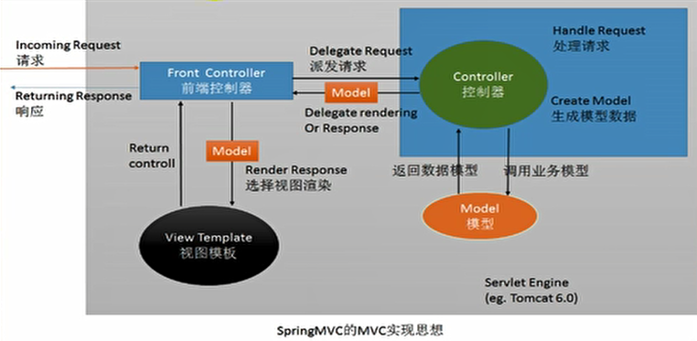

## 1、核心功能

- SpringMVC：Spring实现Web模块。

  

- web.xml中配置前端控制器`DispatcherServlet`。
  - `/*`和`/`都是拦截所有请求，但是`/*`还会拦截jsp页面。
  - 服务器的大web.xml中有一个DefaultServlet中拦截的也是`/`。是Tomcat用来处理静态资源的。
  - web.xml写`/`相当于覆盖禁用了DefaultServlet，导致静态资源无效。
  
- springmvc.xml中配置视图解析器`InternalResourceViewResolver`。

- 不指定springmvc.xml配置文件位置，默认找/WEB-INF/springDispatcherServlet-servlet.xml（前端控制器名-servlet）。

- `@RequsetMapping`的属性：
  - param属性：
    - `{!username}`：表示请求不能带username的参数。还可以指定带参数。
    - `{username!="123"}`：表示不带参数或者参数值不能为123。还可以指定带参数的值必须为什么。
    - 还可以用逗号，分隔多规则。
  - consumes属性：只接受内容类型为那种的请求，规定请求头中的Content-Type。
  - produces属性：高速浏览器返回的类型是什么，给响应头加上Content-Type。
  
- Ant风格的url（模糊匹配）：
  - `?`：替代任意一个字符。
  - `*`：替代零个或任意多个字符和一层路径。
  - `**`：替代零层或多层路径。
  - 多个匹配的情况下，更精确的优先。
  
- REST风格的url（表现层资源状态转换）：
  - 对同一个资源的不同操作，是通过HTTP协议中不同的操作方式来区分的。GET获取、POST新建、PUT更新、DELETE删除。
  - url地址起名：/资源名/资源标识符。资源标识符比如可以为资源的id。
  -  问题是，从页面上只能发起GET和POST请求。
    - SpringMVC中有一个过滤器HiddenHttpMethodFilter，可以将普通的请求转化为规定的PUT或DELETE请求。拦截的url是`/*`。
    - 如何发其他形式的请求：
      - 创建一个post类型的表单。
      - 表单中携带一个`_method`参数，这个参数的值就是所要转化的请求类型。
  
- `@RequestParam`注解：获取请求参数到方法参数。
  - 请求参数与参数列表的名称一致时，自动绑定。
  - 也可以使用注解进行绑定。
  - required属性：是否必须传入，默认true。
  - defaultValue：默认值，默认null。
  
- `@CookieValue`注解：获取指定Cookie到方法参数。

- 如果请求参数是一个POJO，会自动按属性值从request中取出并封装。
  
  - 如果POJO中存在级联属性，只需要在表单的name属性使用`级联属性.子属性`即可。
  
- 数据输出：将数据带给页面。
  
  - 在方法参数列表中处传入Map、Model或ModelMap，这三个参数保存的数据都可以在页面中获取。
    - Model是一个接口，ModelMap是一个类，都可以使用方法`addAttribute()`添加数据。
    - 这三种类型的数据最终都放在request请求域中。
    - 这三种类型的数据格式最后都是BindingAwareModelMap类型，继承了ModelMap（ModelMap实现了Map接口），实现了Model接口。
    - 实际上这三个是同一个BindingAwareModelMap，称之为隐含模型。
  - 方法返回值为ModelAndView类型。
    - 带参构造方法可传入要跳转到的视图对象，也可以使用`setViewName()`方法。
    - 使用方法`addObject()`方法条件数据，数据也放在请求域中。
  - 保存数据到session域中：
    - 使用注解`@SessionAttributes`，只能标在类上。
    - value属性指定BindingAwareModelMap或ModelAndView中保存的数据的键，同时也存入session域中。
    - type属性表示把该类型的数据都存入session。
    - 可能会引发异常，建议用原生API给session中放数据。
  - `@ModelAttribute`注解：
    - 加在方法上：这个方法就会提前于目标方法先运行。
    - 加在参数上并指定键：取出刚才在提前运行的方法中，在BindingAwareModelMap或ModelAndView中保存的数据。
  
- 前端控制器DispatcherServlet的结构分析：

  - DispatcherServlet继承了FrameWorkServlet，FrameWorkServlet基础了HttpServletBean，HttpServletBean继承了HttpServlet。
  - FrameWorkServlet中重写了doGet和doPost方法，调用processRequest方法。processRequest中调用了doService抽象方法。
  - DispatcherServlet中实现了doService方法，其中调用了doDispatcher方法。

- 请求处理的流程（doDispatcher方法）：
  - getHandler方法根据请求地址，决定那个控制器类处理当前请求，获取目标处理器类。如果没找到对应的控制器，就报错。
  - getHandlerAdapter方法拿到能执行控制器类中所有方法的适配器ha。就是拿到了一个反射工具。
  - ha.handle适配器执行目标方法，将返回值保存到ModelAndView中。
  - processDispatcherResule方法执行，转发到目标页面。
- getHandler方法怎么找到控制器类的：
  - 返回一个目标处理器类的执行链。
  - handlerMapping处理器映射，保存了那个请求由那个控制器来处理。
  - 其中的handlerMap，在IOC容器启动时自动创建Controller对象时扫描每个处理器能出来什么请求并保存。
- DispatcherServlet中的九个引用类型的属性，被称为SpringMVC的九大组件：
  - SpringMVC工作时的关键位置都是由九大组件完成的。全部都是接口。
  - multipartResolver：文件上传解析器。
  - localeResolver：区域信息解析器，与国际化有关。
  - themeResolver：主题解析器。
  - handlerMappings：处理器映射器。
  - handlerAdapters：处理器适配器。
  - handlerExceptionResolver：异常解析器。
  - viewNameTranslator：视图名转换器。
  - flashMapMapper：运行重定向携带数据。
  - viewResolvers：视图解析器。
  - onRefresh方法中初始化九大组件。初始化会先从容器中找对应的bean，找不到就使用默认配置。
- 用反射执行控制器方法时，如何确定目标方法每一个参数的值：
  - ha.handler执行目标方法。
    - 其中的invokeHandlerMethod方法执行目标方法。
    - 其中的methodInvoke.invoekHandlerMethod方法执行目标方法。
    - 先运行modelAttribute方法，再运行目标方法。
    - resolveHandlerArguments方法确定目标方法执行时方法的参数值。 分别解析注解、原生API、BindingAwareModelMap、自定义参数。

## 2、视图解析、Restful、数据绑定

- 有前缀的转发/重定向，与配置的视图解析器无关。
- 方法执行后的返回值会做为页面地址参考，转发或重定向到页面。
- 视图解析器可能会进行页面地址的拼串。
- 请求处理方法执行完成后，最终都会返回一个ModelAndView对象。
- 视图解析流程：
  - 任何方法的返回值，最后都会被包装成ModelAndView对象。
  - processDispatcherResule方法执行，转发到目标页面。视图渲染，将域中的数据放到页面展示。
  - render方法渲染页面。其中renderMergedOutputModel对象对页面输出数据渲染。
  - resolverViewName方法执行，根据视图名获得view对象。
  - creatView方法执行，创建view对象。查看是否是转发/重定向前缀，否则加上配置的前缀和后缀。
  - 获得视图对象InternalResourceView。
  - 视图解析器只是为了得到视图对象，视图对象才能真正转发（数据放入请求域中）/重定向到页面（渲染视图）。
- JstlView视图对象支持便捷的国际化功能：
  - 在xml中在视图解析器中，配置视图类型为JstlView。
  - 可以支持快速国际化。
    - 让Spring管理国际化资源，配置资源文件管理器ResourceBundleMessageSource，指定国际化文件的基础名。。
    - 直接去页面使用`<fmt:message>`。
- `<mvc:view-controller>`标签：
  - j将请求映射一个页面，直接来到WEB/INF下的页面。
  - path属性：指定那个请求。
  - view-name属性：指定映射给那个视图。
  - 为了不影响其他请求，还需要开启`<mvc:annotation-driven>`。
- 自定义视图和视图解析器：
  - 视图解析器根据方法的返回值得到视图对象。
  - 多个视图解析器都会尝试能否得到视图对象。
  - 视图对象不同就可以实现不同功能。
  - 编写自定义视图解析器，实现ViewResolver接口，实现方法resolveViewName根据视图名返回视图对象。
  - 编写自定义视图，实现view接口，实现方法render渲染视图。
  - 需要让自定义的视图解析器工作，返回自定义视图对象。
  - 自定义视图解析器必须放入IOC容器中，SpringMVC才能调用该视图解析器。
  - 为了先让自定义视图解析器运行，需要调整视图解析器的配置顺序。自定义视图解析器需要实现order接口（order属性数据越小优先级越高）。
- Restful风格的CRUD：
  - SpringMVC的表单标签，实现将模型数据中的属性和HTML表单元素绑定，更便捷的实现回显。
  - 导入标签库：springframework.org/tags/form。
  - form表单使用`<form:form>`。modelAttribute指定访问页面前，请求域中需要有一个该名称为键的对象。
  - iuput输入使用`<form:input>`，path当作原生的name项，并且可以自动回显隐含模型中某个对象对应的该属性的值。
  - `<mvc:default-servlet-handler>`标签，表示默认处理器，有映射的进行映射，没有映射的放行。需要配合开启`<mvc:annotation-driven>`。
    - 都不配，动态资源能访问，静态资源不能访问。
      - DefaultAnnotationHandlerMapping保存了动态资源的映射信息，但没有静态资源的信息。
      - AnnotationMethodhandlerAdapter执行目标方法。
    - 配了前者，静态资源能访问，动态资源不能访问。
      - DefaultAnnotationHandlerMapping变为了SimpleUrlHandlerMapping，将所有请求都交给了Tomcat。
      - AnnotationMethodhandlerAdapter没有了。
    - 配了后者，动态资源能访问，静态资源不能访问。
    - 都配了，动态静态资源都能访问。
      - 新出现了RequestMappingHandlerMapping，用于处理动态资源。
      - 新出现了RequestMappingHandlerAdapter。
- 数据绑定：
  - Databinder绑定数据：
    - ConversionService组件进行数据类型转换、数据格式化。ConversionService中有许多converter，用于进行不同的类型转换。
    - Validator组件对已经绑定请求信息的入参对象进行数据校验。
    - BindingResult组件包含了校验错误结果。
  - 自定义类型转换器：
    - 实现converter接口自定义类型转换器。
    - 把converter的实现放入ConversionService中。
      - 在xml中配置ConversionServiceFactoryBean（如果还需要使用格式化功能，需要配置FormattingConversionServiceFactoryBean）。
      - converters中添加实现的converter。
      - `<mvc:annotation-driven>`中指定conversion-service为自己配置的类型转换组件。
      - 这样的类型转换组件中也包含默认的转换器。
- `<mvc:annotation-driven>`注解：
  - 注册九大组件中的handlerMappings、handlerAdapters和handlerExceptionResolver。
  - 支持使用ConversionService进行类型转换。
  - 支持`@NumberFormat`、`@DateTimeFromat`进行数据类型格式化。
  - 支持使用`@Valid`进行JSR 303表单校验。
  - 支持使用`@RequestBody`、`@ResponseBody`处理ajax请求。

## 3、应用

- 数据校验：
  - 只做前端校验不安全。
  - SpringMVC可以使用JSR 303做数据校验，通过给Bean 的属性上标注注解来实现。
  - 使用校验框架hibernate-validator。
  - `@NotEmpty`不为空、`@Email`电子邮件、`@Past`过去的日期、`@Future`未来的时间、`@Length`指定长度范围。
  - 在message属性中可以写入提示信息。
  - 告诉SpringMVC这个JavaBean需要校验，使用注解`@Valid`在方法参数前。
  - 如何知道校验结果：给需要校验的JavaBean后紧跟一个BindingResult，封装了前一个bean的校验结果。
  - 在前端显示错误信息`<form:error>`标签。
  - 其他方式取出错误信息：
    - 使用result.getFieldErrors()方法获取错误信息。
    - 将错误信息存入请求域中。
  - 国际化校验：
    - 编写国际化配置文件，键是错误代码，值是提示信息。
    - 读入配置文件。
    - 来到页面取值。
- SpringMVC支持ajax：
  - 对于服务器来说就是返回一个JSON数据。
  - 在控制器方法上加注解`@ResponseBody`，返回的如果是对象自动转为JSON格式。把数据放入响应体中。
  - 在Javabean上加数据`@JsonIngore`，输出数据时忽略这个属性。
  - 在Data类型的数据上加`@JsonFormat(partten="")`，格式化日期。
  - 在控制器方法的输入参数上加注解`@RequestBody`，该参数的内容被赋值为请求体的数据（可以接收JSON）。获取请求体。
  - 发送JSON数据给服务器，把js对象转为JSON：JSON.stringify(js对象)。
  - 参数列表处写HttpEntity类型，可以获取到请求头。
  - 返回类型为ResponseEntity，既能返回响应数据还可以定制响应头。
- 文件上传：
  - 前端页面form表单写属性enctype="multipart/form-data"。
  - 配置文件中配置文件上传解析器。
  - 在参数列表中用MultipartFile类型的参数获取（多文件上传则是一个数组）。
  - transForTo方法保存。
- 国际化：
  - 编写国际化资源文件。
  - 让SpringMVC的ResourceBundleMessageSource管理国际化资源文件。
  - 在页面用`<fmt:message>`取值。
  - 用区域信息解析器LocaleResolver解析区域信息。
- 异常处理：
  - 异常解析器ExceptionHandlerExceptionResolver处理加了`@ExceptionHandler`注解的处理方法，value传入要处理的异常类型。
  - 获取异常信息，在方法的参数列表中写Exception类型。
  - 异常解析器ResponseStatusExceptionResolver处理加了`@ResponseStatus`注解的异常类，这个类自定义了可能出现的异常。 
- SpringMVC的运行流程：
  - 所有请求，前端控制器DispatcherServlet收到请求，调用doDispatch进行处理。
  - 根据HandlerMapping中保存的请求映射信息找到处理当前请求的处理器执行链HandlerExcutionChain。
  - 根据当前处理器找到HandlerAdapter适配器。
  - 拦截器的preHandler先执行。
  - 适配器执行目标方法，返回ModelAndView：
    - ModelAttribute注解标注的方法提前执行。
    - 执行目标方法，确定目标方法用的参数，按注解、model等、自定义类型（先看隐含模型，再看Session，最后用反射创建对象）的顺序确定。
  - 拦截器的postHandler执行。
  - 处理结果，渲染页面。
    - 如果有异常，使用异常解析器处理异常，返回ModelAndView。
    - 调用render进行页面渲染。
      - 视图解析器根据视图名得到视图对象。
      - 视图对象调用render渲染页面。
  - 执行拦截器的afterCompletion。