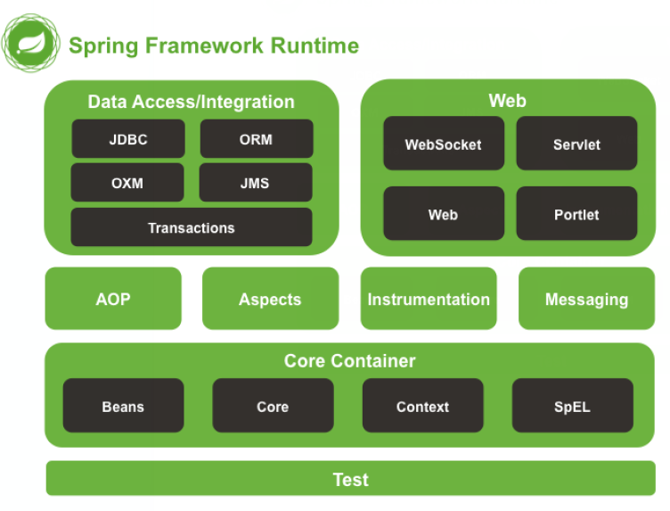

## 1、Spring入门

> Spring是分层的Java SE/EE应用 full-stack轻量级开源框架，以IoC（Inverse Of Control：反转控制）和AOP（Aspect Oriented Programming：面向切面编程）为内核，提供了展现层Spring MVC和持久层Spring JDBC以及业务层事务管理等众多的企业级应用技术，还能整合开源世界众多著名的第三方框架和类库，逐渐成为使用最多的Java EE企业应用开源框架。

- 两大核心：IOC反转控制和AOP面向切片编程。

- Spring的优势：方便解耦、简化开发、AOP编程的支持、声明式事务的支持、方便程序测试和集成框架、降低JavaEE API的使用难度。

- Spring的体系结构：

  - Core Container：核心容器，任何组件运行都需要核心容器，IOC相关。
  - AOP层。
  - 持久层。
  - Web层。
  - Test层。

  

- 程序的耦合：

  - 传统的JDBC的使用：

    ```java
    public class JdbcDemo1 {
        public static void main(String[] args) throws SQLException {
            //1、注册驱动
            DriverManager.registerDriver(new com.mysql.jdbc.Driver());
            //2、获取连接
            Connection conn = DriverManager.getConnection("jdbc:mysql:///localhost:3306/spring","root","root");
            //3、获取预处理对象
            PreparedStatement pstm = conn.prepareStatement("select  * from account");
            //4、执行SQL
            ResultSet rs = pstm.executeQuery();
            //5、遍历结果
            while (rs.next()) {
                System.out.println(rs.getString("name"));
            }
            //6、释放资源
            rs.close();
            conn.close();
            pstm.close();
        }
    }
    ```

    - 如果不导入 mysql ，则会出现编译期报错，缺少编译期依赖。

  - 程序的耦合：程序间的依赖关系。

    - 类之间的依赖。
    - 方法之间的依赖。

  - 解耦：降低程序间的依赖关系。

  - 应该做到的是，编译期不依赖，运行时才依赖。

  - 可以使用反射注册驱动：

    ```java
    Class.forname("com.mysql.jdbc.Driver");
    ```

    - 此时是一个运行时异常，而不是编译期错误。

  - 解耦的思路：

    - 使用反射创建对象，而避免使用`new`关键字。
    - 通过读取配置文件来获取要创建的对象的全类名。

-  工厂类和工厂模型：

  - 例如在三层架构中，服务层service 调用持久层dao，需要 new 一个 dao的实现类。表现层Servlet 调用服务层service 也需要 new 一个 service 实现类，使得程序耦合性很高。

  - Bean：在计算机中有可重用组件的含义。

  - JavaBean：不只是实体类，而是指用Java编写的可重用组件。

  - 创建配置文件，用键值对的形式存储全类名。然后通过反射创建对象。

  - 使用工厂模型解耦：

    ```java
    //BeanFactory.java
    public class BeanFactory {
    
        private static Properties props;
    
        static {
             try {
                 props = new Properties();
                 InputStream in = BeanFactory.class.getClassLoader().getResourceAsStream("bean.properties");
                 props.load(in);
            } catch (IOException e) {
                e.printStackTrace();
            }
        }
    
        public static Object getBean(String beanName) {
            Object bean = null;
            String beanPath = props.getProperty(beanName);
            try {
                bean = Class.forName(beanPath).newInstance();
            } catch (InstantiationException e) {
                e.printStackTrace();
            } catch (IllegalAccessException e) {
                e.printStackTrace();
            } catch (ClassNotFoundException e) {
                e.printStackTrace();
            }
            return bean;
        }
    }
    
    //Client.java
    public class Client {
        public static void main(String[] args) {
            AccountService accountService = (AccountService) BeanFactory.getBean("accountService");
            accountService.saveAccount();
        }
    }
    ```

  - 服务层的表现层：

    ```java
    //AccountServiceImpl.java
    public class AccountServiceImpl implements AccountService {
        private AccountDao accountDao = (AccountDao) BeanFactory.getBean("accountDao");
        
        public void saveAccount() {
            accountDao.save();
        }
    }
    //AccountDaoImpl.java
    public class AccountDaoImpl implements AccountDao {
        @Override
        public void save() {
            System.out.println("baocun");
        }
    }
    ```

  - 这样每次反射都要重新创建对象，是多例的，但是单例的效果更高。可以使用一个容器，保存所有反射创建的对象。

    ```java
    public class BeanFactory {
    
        private static Properties props;
        private static Map<String, Object> beans;
        static {
             try {
                 props = new Properties();
                 InputStream in = BeanFactory.class.getClassLoader().getResourceAsStream("bean.properties");
                 props.load(in);
                 beans = new HashMap<String, Object>();
                 Enumeration keys = props.keys();
                 while (keys.hasMoreElements()) {
                     String key = keys.nextElement().toString();
                     String beanPath = props.getProperty(key);
                     Object value = Class.forName(beanPath).newInstance();
                     beans.put(key, value);
                 }
            } catch (Exception e) {
                e.printStackTrace();
            }
    
        }
    
        public static Object getBean(String beanName) {
            return beans.get(beanName);
        }
    }
    ```

    

## 2、IOC

> 控制反转，把创建对象的权利交给框架或工厂，削减了耦合关系。

- 创建配置文件 bean.xml 并导入约束：

  ```xml
  <?xml version="1.0" encoding="UTF-8"?>
  <beans xmlns="http://www.springframework.org/schema/beans"
         xmlns:xsi="http://www.w3.org/2001/XMLSchema-instance"
         xsi:schemaLocation="http://www.springframework.org/schema/beans
          http://www.springframework.org/schema/beans/spring-beans.xsd">
      
  </beans>
  ```
  
- 把对象交给 Spring 管理：

  ```xml
  <bean id="accountService" class="cn.iwehdio.service.Impl.AccountServiceImpl"></bean>
  <bean id="accountDao" class="cn.iwehdio.dao.Impl.AccountDaoImpl"></bean>
  ```

  - `id`属性是键，`class`属性是所要创建的全类名。

- 使用spring创建对象：

  ```java
  public class Client {
      public static void main(String[] args) {
          //1、获取核心容器
          ApplicationContext ac = new ClassPathXmlApplicationContext("bean.xml");
          //2、根据Id获取bean对象
          AccountService accountService = (AccountService) ac.getBean("accountService");
          AccountDao accountDao = ac.getBean("accountDao", AccountDao.class);
          System.out.println(accountService);
          System.out.println(accountDao);
      }
  }
  ```

  - 两种获取方式，强转或传入字节码。

- `ApplicationContext`的三个实现类：
  
  - `ClassPathXmlApplicationContext`：可以加载类路径（resources）下的配置文件，要求文件必须在类路径下。
  - `FileSystemXmlApplicationContest`：可以加载磁盘任意路径下的配置文件。
  - `AnnotationConfigApplicationContext`：用于读取注解创建容器。
  
- 核心容器的两个接口：

  - `ApplicationContext`：在构建核心容器时，创建对象采取的策略是立即加载的方式。一读取完配置文件就马上创建配置文件中的对象。
  - 使用场景是单例对象。一般使用此对象。
  - `BeanFactory`：在构建核心容器时，创建对象采取的策略是延迟加载的方式。什么时候获取，什么时候才创建对象。
  - 使用场景是多例对象。

- 三种创建 bean 对象的方式：

  1. 使用默认构造函数创建。使用 `<bean>`标签，且除了 id 和 class 没有其他属性。如果没有默认构造则不能创建。

     ```xml
     <bean id="创建的类" class="创建的类的全类名"></bean>
     ```

  2. 使用普通工厂中的方法创建对象（使用某个类中的方法创建对象）。

     ```xml
     <bean id="工厂创建的类" factory-bean="工厂类全类名" factory-method="工厂中创建对象的方法"></bean>
     ```

  3. 使用静态工厂中的静态方法创建对象（使用某个类中的静态方法创建对象）。

     ```xml
     <bean id="静态创建的类" class="工厂类全类名" factory-method="静态方法"></bean>
     ```

- bean 的作用范围：

  - 默认情况下是单例的。也就是多次创建的是同一个对象。
  - `<bean>`标签的 `scope` 属性用于指定作用范围：
    - singleton：单例、默认值。
    - prototype：多例。
    - request：作用于 Web 应用的请求范围。
    - session：作用于 Web 应用的会话范围。
    - global-session：作用于集群环境的会话范围。

- bean 的生命周期：
  - 对于单例对象：生命周期与容器相同。
    - 当容器创建时，对象出生。
    - 容器存在时，对象一直存在。
    - 容器销毁时，对象也销毁。
  - `<bean>`标签的 `init-method`和`destroy-method` 属性用于指定初始化前和销毁后的方法。
  - 对于多例对象：
    - 对象将要被使用时，对象出生。
    - 对象在使用过程中一直存在。
    - 对象长时间没有被使用且没有别的对象引用时，由垃圾回收器回收。

## 3、Spring依赖注入

- 依赖关系的维护：在当前类所需要其他类的对象，由Spring提供，只需在配置文件中配置。

> dependency Injection，依赖关系的维护称为依赖注入。

- 能注入的数据：

  - 基本类型和String。
  - 在配置文件或注解中配置的 bean 。
  - 复杂类型 / 集合类型。

- 注入的方式：

  - 构造函数提供。
  - set 方法提供。
  - 注解提供。

- 使用构造函数注入：

  - 经常变化的数据不适合注入的方式。

  - 使用`<bean>` 标签中的 `<constructor-arg>`标签。

  - type 属性：用于指定所要注入的数据类型，是构造函数中某些参数的类型。

  - index 属性：用于指定要注入的数据给构造函数中指定索引位置的参数赋值（从0开始）。

  - name 属性：用于给构造函数中指定名称的参数赋值。

  - value 属性：用于提供基本类型和String类型的数据。

  - ref 属性：用于引入其他的 bean 类型数据，即在 Spring 的 IOC 核心容器中出现过的 bean 对象。

  - 优势：获取 bean 对象时，注入数据是必须的操作，否则无法创建。

  - 劣势：改变了 bean 对象的实例化方式，使得在创建对象时必须注入规定好的数据。

  - 示例：

    - 在 accountServiceImpl 中创建：

      ```java
      public class AccountServiceImpl implements AccountService {
      
          private AccountDao accountDao = new AccountDaoImpl();
          private String name;
          private Integer age;
          private Date birthday;
      
          public AccountServiceImpl(String name, Integer age, Date birthday) {
              this.name = name;
              this.age = age;
              this.birthday = birthday;
          }
      
          public void saveAccount() {
              System.out.println(name+' ' + age+" "+birthday);
          }
      }
      ```

    - 在 bean.xml 中配置：

      ```xml
      <bean id="accountService" class="cn.iwehdio.service.Impl.AccountServiceImpl">
          <constructor-arg name="age" value="18"></constructor-arg>
          <constructor-arg name="name" value="test"></constructor-arg>
          <constructor-arg name="birthday" ref="now"></constructor-arg>
      </bean>
      
      <bean id="now" class="java.util.Date"></bean>
      ```

    - 测试：

      ```java
      public class Client {
          public static void main(String[] args) {
              //1、获取核心容器
              ApplicationContext ac = new ClassPathXmlApplicationContext("bean.xml");
              //2、根据Id获取bean对象
              AccountService accountService = (AccountService) ac.getBean("accountService");
              accountService.saveAccount();
          }
      }
      ```

- set 方法注入：
  - 使用`<bean>` 标签中的 `<property>`标签。
  - name 属性：注入时调入的 set 方法名称（属性名）。
  - value 属性：提供基本类型和String的数据。
  - ref 属性：提供 bean 类型数据。
  - 优势：创建对象时没有明确的现在，可以使用默认构造。
  - 劣势：如果某个成员必须有值，无法保证注入。
- 集合的注入：
  - 使用 `<property>`标签中包含的标签。
  - 数组使用`<array>`标签下的`<value>`内注入。
  - List使用`<list>`标签下的`<value>`内注入。
  - Set使用`<set>`标签下的`<value>`内注入。
  - Map使用`<map>`标签下的`<entry>`标签的key和value属性。
  - Rroperty使用`<map>`标签下的`<prop>`标签的key和包含的value内容。
  - 在List结构和Map结构集合中可互换。