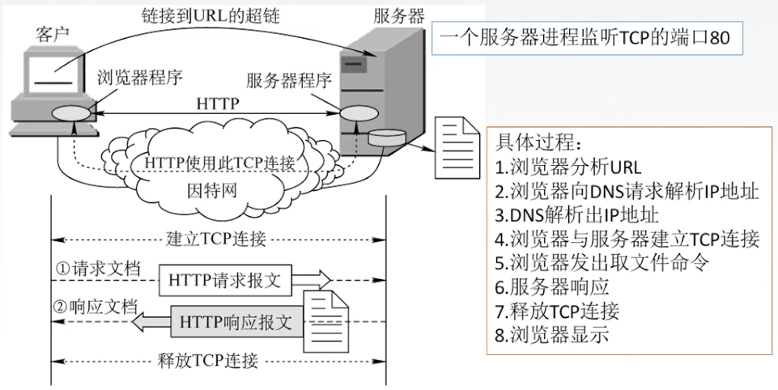
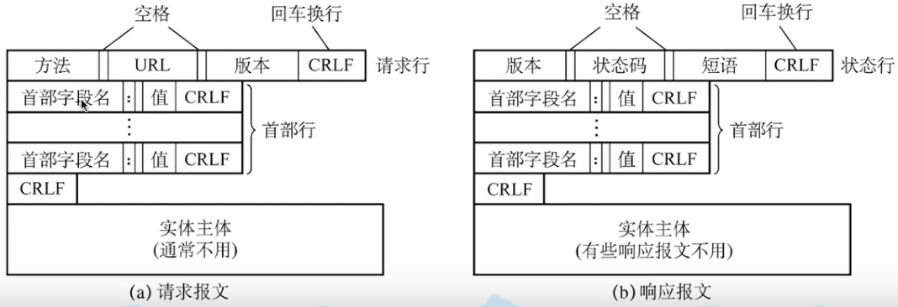

## 1、DNS等协议

- 应用层协议主要包括：HTTP、FTP、DNS等。每个应用层协议都表示一个Web服务。
- 域名的组成：
  - 级别自左向右从低到高。
  - 分为顶级域名、二级域名、三级域名等，根指域名最后的一个点.。

- 域名服务DNS：
  - 作用：将域名解析为IP地址。
  - 输入地址后，发送请求给DNS服务器，返回解析后的IP地址。再访问该IP地址。
- 域名服务器：
  - 本地域名服务器：负责处理本地DNS查询请求。
  - 根域名服务器：管理顶级域名服务器。
  - 顶级域名服务器：管理二级域名服务器。
  - 权限域名服务器：管理一个区的域名服务器。
- 域名解析的过程：
  - 根DNS服务器不负责具体的域名解析服务，但是将域名解析的需求分发出去。
  - 需求会被分发到com、net、edu和cn等多个顶级域名服务器。
  - 域名解析的结果，会在本地缓存。
  - 当一个主机发送DNS查询请求时，这个查询请求报文就发给本地域名服务器。查询不到时，会请求根域名服务器。
  - 根域名服务器知道顶级域名服务器对应的IP地址。然后依次向下查询。
  - 分为递归查询和迭代查询。递归查询靠别人，迭代查询靠自己。
  - 递归查询是，本地域名服务器查询根域名服务器，查不到再由根域名服务器查询顶级域名服务器，然后依次由上一级服务器对下一级服务器进行查询查询。
  - 迭代查询是，本地域名服务器自己依次从根域名服务器往下按级别查询。

- DHCP：动态主机配置。
- DHCP客户端请求IP地址的过程：
  - 客户机广播请求DHCP服务器分配IP地址。
  - DHCP服务器根据MAC地址分配给客户机IP地址。
  - 客户机确认获取那台的DHCP服务器分配的IP地址。
- DHCP服务器必须为静态地址。

- FTP：文件传输协议。
  - 提供不同种类主机系统之间的文件传输能力。
  - TCP控制连接（21端口）：用于发送FTP控制命令信息。
  - TCP数据连接：用于上传下载数据。
    - 主动模式（20端口）：FTP客户端告诉FTP服务器使用什么端口侦听。FTP服务器使用这个端口主动和FTP客户端建立连接。
    - 被动模式：FTP服务器告诉FTP客户端打开了那个端口，等待客户端连接。
    - 主动模式需要防火墙打开21和20端口。

- Telnet：远程终端协议。
  - 用于远程调试网络设备。
  - 默认使用23端口。

- RDP：远程桌面协议。
  - 用于远程连接计算机。

- 收发电子邮件的协议（SMTP、POP3、IMAP）：
  - 查找对方邮件服务器的位置，需要访问DNS服务器。
  - 发送邮件使用SMTP协议，收邮件使用POP3或IMAP协议。

## 2、HTTP协议

- 万维网：是一个大规模的、联机式的信息储藏资源，是无数个网络站点和网页的集合。

- 统一资源定位符URL一般形式：`<协议>://<主机>:<端口>/<路径>`。

- HTTP：超文本传输协议。
  
  - 定义了浏览器怎样向万维网服务器请求万维网文档，以及服务器怎样把文档传送给浏览器。
  
  - 从输入URL到页面显示之间发生了什么：
  
    
  
  - HTTP协议的特点：
  
    - HTTP协议是无状态的。
    - 但是实际上，一些站点常常希望识别用户。这就产生了Cookie，是存储在用户主机中的文本文件，记录一段时间内用户的访问记录。
    - 采用TCP作为传输层协议，但HTTP协议本身是无连接的（交换报文前不需要建立连接）。
  
  - HTTP的连接方式：
  
    - 持久链接Keep-alive：
      - 非流水线。
      - 流水线。时间效率较高。
    - 非持久连接Close。时间消耗比较长。
  
    
  
  - HTTP协议的报文结构：
  
    - 分为请求报文和响应报文。
    - 响应报文的状态码：
      - 1xx表示通知信息。
      - 2xx表示成功，接收或者知道了。
      - 3xx表示重定向。
      - 4xx表示客户的差错。
      - 5xx表示服务器的差错。
  
    

- Web代理服务器：
  - 不直接访问web服务器，而是通过web代理服务器访问。
  - 代理服务器可以缓存外网web服务器的内容。
  - 应用场景：
    - 节省内网访问外网的带宽。
    - 通过代理服务器绕过防火墙。 