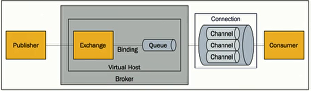
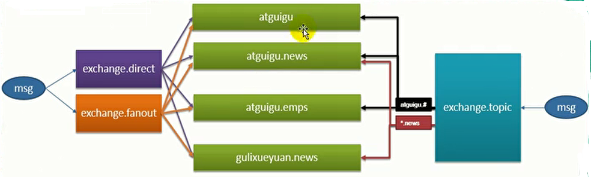

## 1、缓存

- JSR-107：定义了五个核心接口（CachingProvider、CacheManager、Cache、Entry、Expiry），用于操作缓存。

- Spring缓存抽象：定义了Cache和CacheManager接口来统一不同的缓存技术。

  - CacheManager：缓存管理器，管理各种Cache组件。
  - Cache：缓存接口，定义缓存操作，实现有RedisCache等。
  - `@Cacheable`注解：针对方法配置，能够根据方法的请求参数（默认作为key）对方法返回值进行缓存。如果有缓存就不再调用方法，而从缓存中获取。
  - `@CacheEvict`注解：执行该方法后清空缓存。
  - `@CachePut`注解：方法总是会被调用，而且调用的结果被更新到缓存中。
  - `@EnableCaching`注解：开启基于注解的缓存。
  - KeyGenerator：缓存数据时key的生成策略。
  - serialize：缓存数据时value序列化策略。

- 创建入门工程：

  - 创建工程和数据库文件.

  - 整合Mybatis。

    - 配置文件：

      ```properties
      spring.datasource.url=jdbc:mysql:///jpa
      spring.datasource.username=root
      spring.datasource.password=root
      spring.datasource.driver-class-name=com.mysql.jdbc.Driver
      
      mybatis.configuration.map-underscore-to-camel-case=true
      ```

    - 创建Java Bean。

    - 创建Mapper，并在主程序中用MapperScan指定。

      ```java
      @Mapper
      public interface EmployeeMapper {
      
          @Select("select * from employee where id=#{id}")
          public Employee getEmpById(Integer id);
      
          @Update("update employee set lastName=#{lastName},email=#{email},gender=#{gender},d_id=#{dId} where id=#{id}")
          public void updateEmp(Employee employee);
      
          @Delete("delete employee where id=#{id}")
          public void deleteEmpById(Integer id);
      
          @Insert("insert into employee(lastName,email,gender,d_id) values(#{lastName},#{email},#{gender},#{dId})")
          public void insertEmpById(Employee employee);
      }
      ```

    - 创建service和controller：

      ```java
      @Service
      public class EmployeeService {
          @Autowired
          EmployeeMapper employeeMapper;
      
          public Employee getEmp(Integer id) {
              return employeeMapper.getEmpById(id);
          }
      }
      
      @RestController
      public class EmployeeController {
          @Autowired
          EmployeeService employeeService;
      
          @GetMapping("/emp/{id}")
          public Employee getEmp(@PathVariable("id") Integer id){
              return employeeService.getEmp(id);
          }
      }
      ```

      

- 使用缓存：

  - 开启基于注解的缓存，在主程序上标注。

    ```java
    @SpringBootApplication
    @MapperScan("cn.iwehdio.demo.mapper")
    @EnableCaching
    public class DemoApplication {
        public static void main(String[] args) {
            SpringApplication.run(DemoApplication.class, args);
        }
    }
    ```

  - `@Cacheable`注解：如加在Service层中的查询方法上。

    - 先查看缓存，根据缓存中有没有确定是否调用方法。
    - 注解的属性：
      - value/cacheNames：指定缓存组件的名字，可以指定多个。
      - key：缓存数据使用的键。默认使用方法参数的值。支持SpEL表达式。
      - keyGenerator：key的生成器，可以指定生成器。与key两个属性二选一。
      - cacheManager：缓存管理器组件。
      - cacheResolver：缓存解析器，与cacheManager二选一。
      - condition：指定符合条件的情况下才缓存，支持SpEL表达式。
      - unless：指定条件为true时不缓存，可以获取结果（#result）进行判断。
      - sync：是否使用异步模式。
    - 运行原理：
      - 自动配置类：CacheAutoConfiguration。
      - 各种缓存的配置类，包括各种缓存中间件的配置。
      - 默认生效的配置类：SimpleCacheConfiguration。
      - 在容器中注册了一个CacheManager：ConcurrentMapCacheManager。
      - 可以获取和创建ConcurrentMapCache类型的缓存组件，将数据保存在ConcurrentMap。
    - 运行流程：
      - 方法运行之前，先查询Cache缓存组件，按照`@Cacheable`中的cacheNames指定名字获取。也就是cacheManager（ConcurrentMapCacheManager）获取cache（ConcurrentMapCache）。第一次获取缓存cache，如果没有会自动创建。
      - 去cache中按照`@Cacheable`中的key（或自动生成，默认使用SimpleKeyGenerator）查找缓存的内容。
      - 没有查到缓存，就调用目标方法。将目标方法返回的结果放进缓存中。
      - 如果查到缓存，就从缓存中获取，不执行方法。

  - `@CachePut`注解：加在Service层中的更新方法上。

    - 先调用方法，获取到返回值后存入缓存。

    - 如果想要查询和更新共用一个缓存，需要指定key为相同。

      ```java
      @Service
      public class EmployeeService {
          @Autowired
          EmployeeMapper employeeMapper;
          @Cacheable(cacheNames = "emp", key ="#id")
          public Employee getEmp(Integer id) {
              System.out.println("查询" + id + "号员工");
              return employeeMapper.getEmpById(id);
          }
          @CachePut(cacheNames = "emp", key ="#employee.id")
          public Employee updateEmp(Employee employee) {
              System.out.println("修改" + employee);
              employeeMapper.updateEmp(employee);
              return employee;
          }
      }
      ```

  - `@CacheEvict`注解：加在Service层中的删除方法上。

    - 清除指定的key的缓存。
    - 属性：
      - allEntries：为true时，会清除所有缓存。
      - beforeInvocation：缓存清除是否在方法之前执行。默认在方法执行之后执行。

  - `@Caching`注解：定义复杂的缓存规则，相当于以上三个注解的组合。

    - 使用格式：

      ```java
      @Caching(
          cacheable = {
              @Cacheable
          },
          put = {
              @CachePut
          },
          evict = {
              @CacheEvict
          }
      )
      ```

  - `@CacheConfig`注解：加在Service层的类上。

    - 指定这个类中相关缓存注解的属性。


- 整合redis环境：

  - 引入redis的starter：spring-boot-starter-data-redis。

  - 配置文件：

    ```properties
    spring.redis.host=127.0.0.1
    ```

  - 引入redis后，RedisAutoConfiguration自动配置类就生效了。提供了模板对象：

    ```java
    @Autowired  //操作k-v都是字符串的
    StringRedisTemplate stringRedisTemplate;
    @Autowired  //操作k-v都是对象的
    RedisTemplate redisTemplate;
    ```

  - 操作redis数据的方法：

    ```java
    //分别操作字符串、列表、集合、散列和有序集合
    stringRedisTemplate.opsForValue().
    stringRedisTemplate.opsForList().
    stringRedisTemplate.opsForSet().
    stringRedisTemplate.opsForHash().
    stringRedisTemplate.opsForZSet().
    
    //redisTemplate中也有类似方法
    
    //保存和获取方法
    stringRedisTemplate.opsForValue().append("message", "hello");
    stringRedisTemplate.opsForValue().get("message");
    stringRedisTemplate.opsForValue().leftPush("mylist","1");
    
    //保存序列化对象（实体类已实现序列化接口）
    redisTemplate.opsForValue().set("emp", emp);
    ```

  - 改变默认序列化规则，自动序列化为JSON后保存。编写自动配置类，设置默认序列化机制为转化为JSON（参考RedisAutoConfiguration下的redisTemplate方法）：

    ```java
    @Configuration
    public class ResdisJsonConfiguration {
        @Bean
        public RedisTemplate<Object, Employee> EmpRedisTemplate(
                RedisConnectionFactory redisConnectionFactory)
                throws UnknownHostException {
            RedisTemplate<Object, Employee> template = new RedisTemplate<Object, Employee>();
            template.setConnectionFactory(redisConnectionFactory);
            Jackson2JsonRedisSerializer<Employee> jsonRedisSerializer = new Jackson2JsonRedisSerializer<Employee>(Employee.class);
            template.setDefaultSerializer(jsonRedisSerializer);
            return template;
        }
    }
    ```

    - 测试：

      ```java
      @Autowired
      RedisTemplate<Object,Employee> empRedisTemplate;
      @Test
      public void test01() {
          Employee empById = employeeMapper.getEmpById(1);
          empRedisTemplate.opsForValue().set("emp-01",empById);
      }
      ```

  - 运行原理：

    - redis在容器中注册了RedisCacheManager，原来的SimpleCacheManager（检测到容器中已经有CacheManager）不再存在。

    - RedisCacheManager创建RedisCache组件，操作redis使用的是RedisTemplate，默认使用JDK序列化机制。

    - 如果要序列化为JSON存入redis，需要自定义RedisCacheManager。此时原生RedisCacheManager不会创建。在配置类中添加（参考RedisCacheConfiguration.java）：

      ```java
      @Bean
      public RedisCacheManager employeeCacheManager(RedisTemplate<Object, Employee> empRedisTemplate) {
          RedisCacheManager cacheManager = new RedisCacheManager(empRedisTemplate);
          cacheManager.setUsePrefix(true);
          return cacheManager;
      }
      ```

    - 但是这样会导致所有对象从redis存入或读取JSON都是以Employee对象为规则，读取其他对象时会出错。

    - 所以需要针对不同对象配置不同的RedisCacheManager和RedisTemplate。在使用时，在注解的属性中指定不同的cacheManager属性。

    - 多个CacheManager时，需要有一个作为主CacheManager，在其配置上加`@Primary`注解。

  - 编码的方式存入缓存：

    ```java
    //自动注入缓存管理器
    @Autowired
    @Qualifier("employeeCacheManager")
    RedisCacheManager employeeCacheManager;
    
    //根据id获取缓存
    Cache emp = employeeCacheManager.getCache("emp");
    //操作缓存
    emp.put("emp:1", employee);
    ```

    

## 2、消息

- 在应用中，可通过消息服务中间件来提升系统异步通信、扩展解耦能力。

-  消息服务中的两个重要概念：

  - 消息代理。
  - 目的地。
  - 当消息发送者发送消息以后，将由消息代理接管，消息代理保证消息传递到指定目的地。

- 消息队列主要有两种形式的目的地：

  - 队列：点对点消息通信。
  - 主题：发布/订阅消息通信。

- JMS-Java消息服务：

  - 基于JVM消息代理的规范。ActiveMQ、HornetMQ是JMS的实现。

- AMQP：

  - 高级消息队列协议，兼容JMS。是网络线级协议，跨平台跨语言的。RabbitMQ是AMQP的实现。
  - 提供了五种消息模型。

- RabbitMQ-AMQP的开源实现：

  - 核心概念：

    - 消息：由消息头和消息体组成。消息头由一系列可选熟悉组成，主要包括路由键routing key。
    - Publisher：消息的生产者，也是一个想交换器发布消息的客户端应用程序。
    - Exchange：交换器，用来接收生产者发送的消息并将这些消息路由给服务器中的队列。有四种类型。
    - Queue：消息队列，用来保存消息指导发送给消费者。是消息的容器，也是消息的终点。
    - Binding：绑定，用于消息队列和交换器之间的交换。交换器和消息队列是多对多的关系。
    - Connection：网络连接。
    - Channel：信道，多路复用连接中的一条独立的双向数据流通道。
    - Consumer：消费者，表示一个从消息队列中取得消息的客户端应用程序。
    -  VirtualHost：虚拟主机，表示一批交换器、消息队列和相关对象。
    - Broker：表示消息队列服务器实体。

    

  - 运行机制：

    - 消息路由：
      - 交换器和绑定规则不同，会导致消息被发送到不同的队列中。
      - Exchange类型：
        - direct：直连。消息中的路由键如果和Binding中的binding key一致，交换器就将消息发到对应的队列中。 完全匹配、单播的点对点专属。
        - fanout：广播。每个发到fanout类型交换器的消息都会分到所有绑定的队列上去。不处理路由键，转发消息是最快的。
        - topic：模糊匹配。通过模式匹配分配消息的路由键属性。将路由键和绑定键的字符用点隔开，识别通配符（#匹配0个或多个单层，*匹配一个单词）。

  - 运行环境：

    - docker下安装：

      ```shell
      docker pull rabbitmq:3-management
      ```

    - 运行并暴露端口号（客户端与RabbitMQ通信的：5672；管理界面访问Web页面的：15672）：

      ```shell
      docker run -d -p 5672:5672 -p 15672:15672 --name myrabbitmq 0067598739d3
      ```

    - 连接15672端口，输入默认用户名和密码guest，进入管理页面。

    - 运行示例：

      - 创建交换器exchange.direct、exchange.fanout和exchange.topic。

      - 创建队列atguigu、atguigu.news、atguigu.emps和gulixueyuan.news。

      - 创建绑定关系。

        

      - 测试发送消息，并查看。

- SpringBoot整合：

  - 引入starter：spring-boot-starter-amqp。

  - 自动配置原理：

    - 自动配置类RabbitAutoConfiguration。
    - 自动配置了连接工程ConnectionFactory。
    - RabbitProperties封装了RabbitMQ的配置。
    - RabbitTemplate：用于给RabbitMQ发送和接受消息。
    - AmqpAdmin：RabbitMQ系统管理功能组件。创建交换器、队列等。

  - 配置文件：

    ```properties
    spring.rabbitmq.host=127.0.0.1
    spring.rabbitmq.username=guest
    spring.rabbitmq.password=guest
    spring.rabbitmq.port=5672
    spring.rabbitmq.virtual-host=/
    ```

  - 测试：

    - 点对点单播消息（单播、广播还是模糊匹配，只需要更改指定的交换器）：

      ```java
      @Autowired
      RabbitTemplate rabbitTemplate;
      //自己构造消息体内容和消息头
      rabbitTemplate.send(exchange,routeKey,message);
      //传入要发送的对象，自动序列化
      rabbitTemplate.convertAndSend(exchange,routeKey,object);
      
      Map<String,Object> map = new HashMap<>();
      map.put("msg","第一个消息");
      rabbitTemplate.convertAndSend("exchange.direct","atguigu.news",map);
      ```

    - 接收消息：

      ```java
      Object o = rabbitTemplate.receiveAndConvert("atguigu.news");
      System.out.println(o.getClass());
      ```

  - 消息序列化为JSON（自定义MessageConverter，参考RabbitTemplate中使用的）：

    ```java
    @Configuration
    public class MyAmqpConfiguration {
        @Bean
        public MessageConverter messageConverter() {
            return new Jackson2JsonMessageConverter();
        }
    }
    ```

- `@RabbitListener`注解：

  - 需要开启基于注解的RabbitMQ：`@EnableRabbit`。

  - queue属性：监听指定的消息队列中的内容，作为方法的输入参数。只要有消息就会被接收。

    ```java
    @Service
    public class rabbitService {
        @RabbitListener(queues = "atguigu.news")
        public void receive(Object o){
            System.out.println(o);
        }
    }
    ```

  - 也可以获取message消息对象，获取消息头message.getProperties/获取消息体message.getBody。

- AmqpAdmin创建好删除消息队列、交换器和绑定规则：

  - 创建交换器：

    ```java
    @Autowired
    AmqpAdmin amqpAdmin;
    
    amqpAdmin.declareExchange(new DirectExchange("amqpAdmin.exchange"));
    ```

  - 创建队列：

    ```java
    amqpAdmin.declareQueue(new Queue("amqpAdmin.queue",true));
    ```

  - 绑定关系：

    ```java
    //绑定队列到交换器，并且指定
    amqpAdmin.declareBinding(new Binding("amqpAdmin.queue", Binding.DestinationType.QUEUE,"amqpAdmin.exchange","amqp.hh",null));
    ```

    

