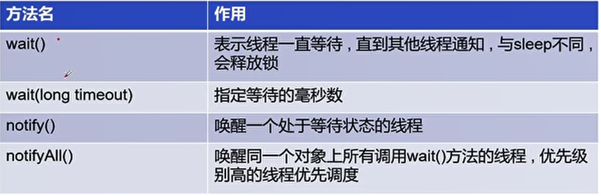

## 1、线程同步

- 并发：同一个对象被多个线程同时操作。

- 线程同步：处理并发问题。形成条件是队列+锁。

- 线程同步其实就是一种等待机制，多个需要同时访问此对象的线程进入这个对象的等待池形成队列，等待前面线程使用完毕，下一个线程再使用。

- 为了保证数据在方法中被访问时的正确性，在访问时加入锁机制`synchronized`。当一个线程获得对象的排它锁，独占资源，其他线程必须等待，使用后释放锁即可。可能存在问题：

  - 一个线程持有锁会导致其他所有需要此锁的线程挂起。
  - 在多线程竞争下，加锁，释放锁会导致比较多的上下文切换和调度延时，引起性能问题。
  - 如果一个优先级高的线程等待一个优先级低的线程释放锁，会导致优先级倒置，引起性能问题。

- 不安全案例：

  - 之前的抢票的例子。

  - 取款的例子：

    ```java
    public class TestSync {
        public static void main(String[] args) {
            Account account = new Account("基金", 100);
            new Bank(account,50, "A").start();
            new Bank(account,100, "B").start();
        }
    }
    
    class Account {
        public String name;
        public int money;
    
        public Account(String name, int money) {
            this.name = name;
            this.money = money;
        }
    }
    
    class Bank extends Thread {
        public Account account;
        public int drawingMoney;
        public int nowMoney;
    
        public Bank(Account account, int drawingMoney, String name) {
            super(name);
            this.drawingMoney = drawingMoney;
            this.account = account;
        }
    
        @Override
        public void run() {
            if(account.money-drawingMoney<0){
                System.out.println("余额不足");
                return;
            }
            try {
                Thread.sleep(200);
            } catch (InterruptedException e) {
                e.printStackTrace();
            }
            account.money -= drawingMoney;
            nowMoney = drawingMoney;
            System.out.println(account.name+"余额为"+account.money);
            System.out.println(this.getName()+"取出"+nowMoney);
        }
    }
    ```

    

- 同步方法：

  - 通过private关键字保证了数据对象只能被方法访问，所以只需要对方法使用`synchronized`关键字。包括synchronized方法和synchronized块。
  - 同步方法格式：`public synchronized void method(int args){}`。
  - synchronized方法控制对对象的访问，每个对象对应一把锁，每个synchronized都必须活动调用该方法的对象的锁才能执行，否则线程会阻塞。
  - 方法一旦执行，就独占该锁，直到该方法返回才释放锁。后边被阻塞的线程才能获得这个锁，继续执行。
  - 若将一个大的方法声明为synchronized将会影响效率。
  - 方法里面需要修改的内容才需要锁，只读的内容不需要锁。
  - 锁中可以是对象也可以class字节码：
    - 对于普通同步方法，锁是当前实例对象。 如果有多个实例 那么锁对象必然不同无法实现同步。
    - 对于静态同步方法，锁是当前类的class对象。有多个实例 但是锁对象是相同的  可以完成同步。
    - 对于同步方法块，锁是Synchonized括号里配置的对象。对象最好是只有一个的 如当前类的 class 。

- 同步块：

  - 同步块格式：`synchronized(obj){}`。
  - obj称之为同步监视器，可以是任何对象，但是推荐使用共享资源（所要进行增删改的对象）作为同步监视器。
  - 同步方法的同步监视器就是对象本身即this。
  - 同步监视器的执行过程：
    - 第一个线程访问，锁定同步监视器，执行其中的代码。
    - 第二个线程访问，发现同步监视器被锁定，无法访问。
    - 第一个线程访问完毕，解锁同步监视器。
    - 第二个线程访问，泛型同步监视器没有锁，然后锁定并访问。

- 不安全案例的同步改造：

  - 抢票的例子：

    ```java
    @Override
    public synchronized void run() {
        while (true) {
            if(ticketNum<=0) {
                break;
            }
            try {
                Thread.sleep(100);
            } catch (InterruptedException e) {
                e.printStackTrace();
            }
            System.out.println(Thread.currentThread().getName()+"拿到了第"+ticketNum--+"张票");
        }
    }
    ```

  - 取款的例子：

    ```java
    @Override
    public void run() {
        //锁的是要进行修改的对象account
        synchronized (account){
            if(account.money-drawingMoney<0){
                System.out.println("余额不足");
                return;
            }
            try {
                Thread.sleep(200);
            } catch (InterruptedException e) {
                e.printStackTrace();
            }
            account.money -= drawingMoney;
            nowMoney = drawingMoney;
            System.out.println(account.name+"余额为"+account.money);
            System.out.println(this.getName()+"取出"+nowMoney);
        }
    }
    ```

    

- Java中的JUC并发包java.util.concurrent：
  
  - JUC安全类型的集合：`CopyOnWriteArrayList`。一个线程安全的列表。
  
- 死锁：

  - 多个线程各自占用一些共享资源，并且相互等待其他线程占有的资源才能运行，而导致两个或多个线程都在等待对象释放资源，都停止执行的情形。

  - 某一个代码块同时拥有两个以上对象的锁时，就可能会发生死锁的问题。

  - 产生死锁的四个必要条件：

    - 互斥条件：一个资源每次只能被一个进程使用。
    - 请求与保持条件：一个进程因请求资源而阻塞时，对已获得的资源保持不放。
    - 不剥夺条件：进程已获得的资源，在未使用完之前，不能强行剥夺。
    - 循环等待条件：若干进程之间形成一种头尾相接的循环等待资源关系。

  - 产生死锁的例子：

    ```java
    public class DeadLock {
        public static void main(String[] args) {
            new dis(0).start();
            new dis(1).start();
        }
    }
    
    class Car{
    }
    
    class Key{
    }
    
    class dis extends Thread{
        //资源只有一份，静态资源
        private static Car car = new Car();
        private static Key key = new Key();
        private int choice;
    
        public dis(int choice) {
            this.choice = choice;
        }
    
        @Override
        public void run() {
            makeup();
        }
    
        public void makeup(){
            if(choice==0) {
                synchronized (car){
                    System.out.println(choice+" 锁住了car");
                    synchronized (key) {
                        System.out.println(choice+" 锁住了key");
                    }
                }
            } else {
                synchronized (key){
                    System.out.println(choice+" 锁住了key");
                    synchronized (car) {
                        System.out.println(choice+" 锁住了car");
                    }
                }
            }
        }
    
    }
    ```

    

- Lock锁：

  - 从JDK5开始提供的更强大的线程同步机制，通过显式定义同步锁对象来实现同步。同步锁使用Lock对象充当。

  - java.util.concurrent.locks.Lock接口是控制多个线程对共享资源进行访问的工具。

  - 锁提供了对共享资源的独占访问，每次只能有一个线程对Lock对象加锁，线程开始访问共享资源之前应先获得Lock对象。

  - 可重入锁ReentrantLock类实现了Lock，拥有与synchronized相同的并发性和内存语义，可以显式加锁、释放锁。

  - Lock是显式锁，手动开启和关闭锁。synchronized是隐式锁，出了作用域自动释放。

  - 使用Lock锁，JVM将花费较少的时间调度线程，性能更好。并且有更好的扩展性。

  - 一般与try/finally一起使用。

  - 使用Lock锁的例子：
  
    ```java
    public class TestLock {
        public static void main(String[] args) {
            Lock lock = new Lock();
            new Thread(lock,"A ").start();
            new Thread(lock,"B ").start();
        }
    }
    
    class Lock implements Runnable {
    
        private int ticketNum = 200;
        private final ReentrantLock lock = new ReentrantLock();
    
        @Override
        public void run() {
            while (true) {
                lock.lock();
                try{
                    if (ticketNum > 0) {
                        try {
                            Thread.sleep(20);
                        } catch (InterruptedException e) {
                            e.printStackTrace();
                        }
                        System.out.println(Thread.currentThread().getName() + ticketNum--);
                    } else {
                        break;
                    }
                } finally {
                    lock.unlock();
                }
            }
        }
  }
    ```
  
    

## 2、线程协作

- 生产者消费者问题：

  - 假设仓库中只能存放一件产品，生产者将生产出来的产品放入仓库，消费者将仓库中产品取走消费。

  - 如果仓库中没有产品，则生产者将产品放入仓库，否则停止生产并等待，直到产品被消费者取走。

  - 如果仓库中放有产品，则消费者可以将产品取走消费，否则停止消费并等待，直到仓库中再次放入产品。

  - 生产者和消费者共享同一个资源，并且生产者和消费者之间相互依赖、互为条件。

  - 需要实现不同线程之间的通信问题。

  - Java提供了几个方法解决线程之间的通信问题：

    

- 管程法：

  - 生产者将生产者将生产好的数据放入缓冲区，消费者从缓冲区拿出数据。

  ```java
  public class TestPC {
      public static void main(String[] args) {
          //创建缓冲区
          Container container = new Container();
          new Producer(container).start();
          new Consumer(container).start();
      }
  }
  
  class Chicken {
      public int id;
  
      public Chicken(int id) {
          this.id = id;
      }
  }
  
  class Producer extends Thread {
      private Container container;
  
      public Producer(Container container) {
          this.container = container;
      }
  
      @Override
      public void run() {
          for (int i = 0; i < 100; i++) {
              container.push(new Chicken(i), i);
          }
      }
  }
  
  class Consumer extends Thread {
      private Container container;
  
      public Consumer(Container container) {
          this.container = container;
      }
  
      @Override
      public void run() {
          for (int i = 0; i < 100; i++) {
              container.pop();
          }
      }
  }
  
  class Container {
      //大小为10的缓冲区
      private Chicken[] chickens = new Chicken[10];
      public int count = 0;     //缓冲区中放入的产品个数
      //生产方法
      public synchronized void push(Chicken chicken, int i) {
          //使用while适用于多个生产者和消费者
          while (chickens.length == count) {
              try {
                  this.wait();
              } catch (InterruptedException e) {
                  e.printStackTrace();
              }
          }
  
          chickens[count] = chicken;
          count++;
          //在生产者或消费者的run方法中获取count会有线程不安全问题
          System.out.println("生产 " + i + " " + count);
  
          this.notifyAll();
      }
  
      public synchronized void pop() {
          while (count == 0) {
              try {
                  this.wait();
              } catch (InterruptedException e) {
                  e.printStackTrace();
              }
          }
  
          count--;
          Chicken chicken = chickens[count];
          System.out.println("消费 " + chicken.id + " " + count);
  
          this.notifyAll();
  
      }
  }
  ```

  

- 信号灯法：

  - 使用一个标志位，为true则等待，为false则唤醒另外一个线程。
  
  ```java
  public class TestPC2 {
      public static void main(String[] args) {
          TV tv = new TV();
          new Producer2(tv).start();
          new Consumer2(tv).start();
      }
  }
  
  class Producer2 extends Thread {
      TV tv;
  
      public Producer2(TV tv) {
          this.tv = tv;
      }
  
      @Override
      public void run() {
          for (int i = 0; i < 20; i++) {
              if(i%2==0) {
                  tv.play("节目1");
              } else {
                  tv.play("节目2");
              }
          }
      }
  }
  
  class Consumer2 extends Thread {
      TV tv;
  
      public Consumer2(TV tv) {
          this.tv = tv;
      }
  
      @Override
      public void run() {
          for (int i = 0; i < 20; i++) {
              tv.watch();
          }
      }
  }
  
  class TV {
      String program;
      boolean flag = true;    //T生产，F消费
  
      public synchronized void play(String program){
          if(!flag){
              try {
                  this.wait();
              } catch (InterruptedException e) {
                  e.printStackTrace();
              }
          }
  
          System.out.println("生产了"+program);
          this.notifyAll();
          this.program = program;
          this.flag = !this.flag;
      }
  
      public synchronized void watch(){
          if(flag){
              try {
                  this.wait();
              } catch (InterruptedException e) {
                  e.printStackTrace();
              }
          }
  
          System.out.println("消费了"+this.program);
          this.notifyAll();
          this.flag = !this.flag;
      }
  }
  ```
  
  

- 线程池：

  - 经常创建和销毁、使用量特别大的资源，比如并发情况下的线程，对性能影响很大。

  - 可以提前创建好多个线程，放入线程池中，使用时直接获取，使用完放回池中。

  - 好处：

    - 提高了响应速度，减少了创建新线程的时间。
    - 降低了资源消耗。
    - 便于线程管理，包括核心池大小、最大线程数、没有任务时多长时间终止等。

  - 线程池相关API：

    - `ExecutorService`：真正的线程池接口，常见子类`ThreadPoolExecutor`。
      - `void execute(Runnable command)`：执行任务。
      - `void shutdown()`：关闭线程池。
    - `Executors`：工具类、线程池的工厂类，用于创建并返回不同类型的线程池。

    ```java
    public class TestPool {
        public static void main(String[] args) {
            //参数为线程池大小
            ExecutorService executorService = Executors.newFixedThreadPool(3);
    
            executorService.execute(new MyThread());
            executorService.execute(new MyThread());
            executorService.execute(new MyThread());
    
            executorService.shutdown();
        }
    }
    
    class MyThread implements Runnable {
    
        @Override
        public void run() {
            System.out.println(Thread.currentThread().getName());
        }
    }
    ```