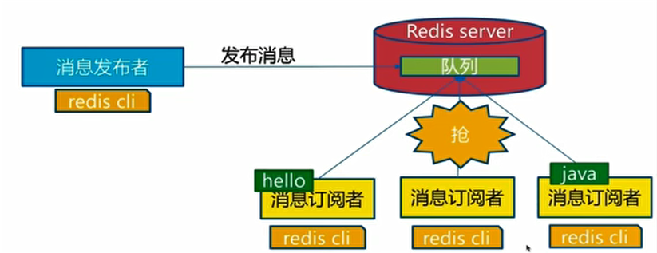

## 1、redis事务

- redis事务：
  - 在redis中单条命令具有原子性，但redis事务不保证原子性不存在要么同时成功、要么同时失败。
  - 事务的本质：一组命令的集合。一个事务中所有命令都会被序列化（队列），按照顺序执行。一次性、顺序性、排他性。
  - redis事务没有隔离级别的概念。所有的命令在事务中并没有直接被执行（在入队的时候），在执行命令的时候才会执行。
  - redis事务的三个阶段：
    - 开启事务，multi。
    - 命令入队，一系列的命令...。
    - 执行事务，exec。
  - 放弃事务：discard，此时事务队列中的命令都不会被执行。
  - 代码异常：
    - 写命令出错（类似编译期异常）：入队时就会报错，事务中的所有命令都不会被执行。
    - 语法错误（类似运行时异常）：执行该命令会抛出异常，但是事务中的其他命令都会执行。


- redis监控：
  - 悲观锁：认为什么时候都会出问题，无论做什么都会加锁。
  - 乐观锁：认为什么时候都不会出问题，所以不会上锁。更新数据时，判断一下在其期间是否有人修改这个数据。
  - 添加监视：`watch 键名`。一次监视只在一次事务期间有效，事务结束后要放弃监视。
  - 放弃监视：`unwatch`。
  - redis实现乐观锁：
    - 对一个键添加监控，主线程在事务中正在对该键进行操作。
    - 如果另一个线程修改了这个键，此时事务就会执行失败。
    - 实现的原理：
      - 在开启监视时，获取该键当前的值。
      - 在执行事务时，比对该键的当前值与开启监控时的值是否相同。
      - 如果两个值相同则执行成功，如果发生变化则执行失败。


## 2、redis集成

- Jedis：

  - 使用Java操作redis的中间件。

  - 导入依赖：

    ```xml
    <dependencies>
        <dependency>
            <groupId>redis.clients</groupId>
            <artifactId>jedis</artifactId>
            <version>3.3.0</version>
        </dependency>
    </dependencies>
    ```

  - 连接redis：

    ```java
    public static void main(String[] args) {
        //直接创建对象
        Jedis jedis = new Jedis("127.0.0.1",6379);
        System.out.println(jedis.ping());
        jedis.close();
    }
    ```

  - 其他方法大多是`jedis.原生方法`。


- 整合到SpringBoot：

  - 导入依赖：spring-boot-starter-data-redis。

  - SpringBoot2.x后，连接redis原来使用的jedis被替换为了lettuce。

    - jedis采用的直连，多个线程操作是不安全的，需要使用jedis pool连接池。
    - lettuce采用netty，实例可以在多个线程中共享，不存在线程不安全的情况。

  - 配置文件：

    ```properties
    spring.redis.host=127.0.0.1
    spring.redis.port=6379
    spring.redis.database=0
    ```

  - 进行操作：

    - 注入redisTemplate。
    - `redisTemplate.opsForValue().方法`：操作字符串。
    - `redisTemplate.opsFor类型().方法`：操作不同类型。
    - `redisTemplate.方法`：操作常用方法。
    - `redisTemplate.getConnectionFactory().getConnection()`：获取连接。

    ```java
    @Autowired
    private RedisTemplate redisTemplate;
    @Test
    void contextLoads() {
        redisTemplate.opsForValue().set("mykey","iwehdio");
        System.out.println(redisTemplate.opsForValue().get("mykey"));
    
    }
    ```

  - 自定义RedisTemplate：

    - 如果传入的值是一个对象，这个对象需要被序列化。

    -  创建JSON序列化对象并在模板中设置：

      ```java
      @Configuration
      public class RedisConfig {
          @Bean
          public RedisTemplate<Object, Object> redisJsonTemplate(RedisConnectionFactory redisConnectionFactory)
                  throws UnknownHostException {
              RedisTemplate<Object, Object> template = new RedisTemplate<>();
              template.setConnectionFactory(redisConnectionFactory);
              Jackson2JsonRedisSerializer<Object> jsonRedisSerializer = new Jackson2JsonRedisSerializer<Object>(Object.class);
              template.setDefaultSerializer(jsonRedisSerializer);
              return template;
          }
      }
      ```

    - 为了简化开发，可以将RedisTemplate的基本操作封装到自己的工具类中。


## 3、redis配置文件

- 在启动时，就需要配置文件启动。
- 配置文件的unit单位对大小写不敏感。
- INCLUDES引入部分，可以将其他配置文件引入。
- NETWORK网络部分：
  - bind 127.0.0.1是指绑定的ip。
  - protected-mode yes表示是保护模式。
  - port 6379端口设置。
- GENERAL通用部分：
  - daemonize yes表示应该设置为守护线程（后台）运行。
  - pidfile /var/run/redis.pid如果以后台方式运行，需要指定一个pid文件。
  - loglevel notice日志级别为生产环境。
  - logfile ""日志的文件位置名。
  - databases 16默认的数据库数量。
- SNAPSHOTTING快照部分：
  - 与持久化有关，在规定的时间内执行的多少操作，则会持久化到文件。
  - save 900 1表示900秒内至少有一个key进行了修改，就进行持久化操作。
  - stop-writes-on-bgsave-error yes表示持久化出错是否还需要继续工作。
  - rdbcompression yes表示是否压缩rdb文件。
  - rdbchecksum yes表示对rdb文件进行错误校验。
  - dir ./表示rdb文件保存的目录。
- REPLICATION复制部分。
- SECURITY安全部分：
  - requirepass 密码 表示连接密码。
  - 在命令行使用`config set required 密码`。
  - 登陆：`auth 密码`。
- CLIENTS客户端部分：
  - maxclients 10000表示最大连接的客户端数量。
  - maxmemory <bytes>表示配置的最大内存。
  - maxmemory-policy noeviction表示内存达到上限之后的处理策略。
- APPEND ONLY MODE aof持久化部分：
  - appendonly no表示默认不开启aof模式，使用rdb方式持久化。
  - appendfilename "appendonly.aof"表示持久化的文件名。
  - appendfsync everysec表示每秒执行一次同步。


## 4、redis持久化

- redis是内存数据库，不保存到磁盘就会断电即失。
- RDB（Redis DataBase）操作：
  - 在指定的时间间隔内将内存中的数据快照写入磁盘。
  - RDB操作下，redis会单独创建（fork）一个子进程来进行持久化，先将数据写入到一个临时文件中，待持久化过程结束，再用临时文件替换上次持久化好的文件。
  - 在整个过程中，主进程不进行任何的IO操作，保证了高性能。
  - 触发机制：
    - 配置文件中的save规则满足。
    - 执行flushall命令。
    - 退出redis。
  - 恢复rdb文件：把文件放在redis启动目录下。生产环境下需要对rdb文件进行备份。
  - 优点：
    - 适合大规模的数据恢复。
    - 对数据的完整性要求不高。
  - 缺点：
    - 需要一定的时间间隔进行操作。
    - 如果意外宕机，最后一次修改的数据就没有了。
    - 开启子线程时，会占用一定的内存空间。


- AOF（Append Only File）操作：
  - 将所有的命令都记录下来，恢复的时候就将命令再执行一遍。
  - 以日志的形式记录每个写操作，只许追加文件不可以改写文件。
  - 默认不开启，需要在配置文件中开启。
  - 如果aof文件有错误，redis是启动不起来的，需要用redisredis-check-aof进行修复。
  - 优点：可以设置为每一次修改都同步，提高文件的完整性。
  - 缺点：
    - aof数据文件的大小远大于rdb。
    - 由于是IO操作，运行效率较低。


- 同时开启两种持久化方式，会默认先载入aof。


## 5、redis发布订阅

- redis发布订阅（pub/sub）是一种消息通信模式，发布者发送消息，订阅者接收消息。

- redis客户端可以订阅任意数量的频道。

- 发布订阅消息图：

  

- 订阅发布命令：

  - 订阅频道：`subscribe 频道名`。
  - 发布消息：`publish 频道名 信息`。

- 发布订阅原理：

  - 通过subscribe订阅某个频道后，redis-server中维护了一个字典，字典的键就是频道名。
  - 字典的值是一个链表， 链表中保存了所有订阅这个频道的客户端。subscribe就是将客户端添加到给定频道的订阅链表中。
  - 通过publish发布消息，redis-server会获得对应频道中的链表，遍历链表发送消息。

- 发布订阅使用场景：

  - 实时消息系统。
  - 实时聊天，将频道作为聊天室。
  - 订阅关注系统。


## 6、redis主从复制

- 主从复制：就是将一台redis服务器的数据，复制到其他的redis服务器。前者称为主节点（master），后者称为从节点（slave）。

- 数据的复制是单向的，只能由主节点到从节点。主节点以写为主，从节点以读为主。可以减缓服务器的分离。

- 默认情况下，每台redis服务器都是主节点，且一个主节点可以由多个从节点，但一个从节点只能有一个主节点。

- 主从复制的主要作用：

  - 数据冗余，实现了数据的热备份。
  - 故障恢复，主节点出问题可以由子节点提供服务，是服务的冗余。
  - 负载均衡：配合读写分离，多个从节点分担读负载。
  - 高可用基石：是哨兵模式和集群能够实施的基础。

- 在真实的项目中，为了避免宕机和性能瓶颈，不会使用单台redis服务器。

- 主从复制环境配置：

  - 复制并修改多个配置文件。
  - 按配置文件启动服务器：`redis-server 配置文件`。
  - 按端口启动客户端：`redis-cli 端口`。
  - 更改不同的端口。
  - 更改pidfile、logfile和dvfilename。
  - 在从机中使用命令`slaveof 主机ip 主机端口号`指定主机。也可以在配置文件中配置。
  - 如果设置`slaveof no one`则指定该从机为主机。
  - 查看主从机`info replication`。

- 主从复制细节：

  - 主机可以写，从机只能读。
  - 主机中的所有信息，都会自动被从机保存。
  - 如果主机宕机，从机默认配置的主机不变。在主机重启后，会重新连接。
  - 如果从机宕机，在此宕机期间主机存入的值，该从机仍然可以拿到（如果是命令行设置的从机，重启后该从机变为默认的主机，需要再次设置为从机）。

- 主从复制原理：

  - slave启动成功连接到master后会发送一个sync同步命令。
  - master接到该命令后，启动后台的存盘进程，同时收集所用接收到的修改数据的命令，在后台进程执行完毕之后，master将传送整个数据文件到slave，完成一次完全同步。
  - 全量复制：slave在接收到数据文件后，将其存盘并加载到内存中。
  - 增量复制：master继续将新的所有收集到的修改命令依此传给slave。
  - 只要有slave重新连接到master，一次完全同步即全量复制就会被自动执行。

- 主从复制的模式：

  - 一主二从。
  - 层层链路，一主一从，同时第二台从机指定为第一台从机的子节点。第一台从机不可以写入。
  - 哨兵模式。

- 哨兵模式：

  - 自动选举主机的模式。当主机宕机后，自动将一台从机切换为主机。
  - 哨兵模式能够在后台监控主机是否故障，如果故障了根据投票数自动将从机转换为主机。
  - 哨兵是一个独立的进程。哨兵通过发送命令，等待redis服务器响应，从而监控运行的多个redis实例。
  - 当哨兵监测到master宕机，会自动将一个slave切换为master，并且通过发布订阅模式通知其他slave切换主机。
  - 一个哨兵进程也有可能出问题，可以使用多个哨兵。哨兵不但监控redis，同时也会互相监控，形成多哨兵模式。
  - 如果主机宕机，哨兵1最先检测到了，但是系统并不会马上进行failover（故障转移）操作，仅仅是哨兵1主观的认为主机不可用，这个现象被称为主观下线。
  - 当后边的哨兵也检测到主机不可用，并且数量达到一定值时，那么哨兵之间会进行一次投票，投票的结果由一个哨兵发起，进行failover操作。切换成功后，让各个哨兵把自己监控的从服务器实现切换主机，这个现象被称为客观下线。

- 哨兵模式配置：

  - 配置哨兵配置文件sentinel.conf：

    ```cmake
    #sentinel monitor 被监控的名称 主机ip 主机端口 投票规则（客观下线需要几个哨兵同意）
    sentinel monitor myredis 127.0.0.1 6379 1
    ```

  - 启动哨兵：

    ```bash
    #windows下
    redis-server sentinel.conf --sentinel
    #linux下
    redis-sentinel sentinel.conf
    ```

  - 如果主机宕机了 ，从从机中选取一个切换为主机（有一个投票算法）。

  - 如果主机重新连接了，只能归并到新的主机下，作为从机。

- 哨兵模式的优缺点：

  - 优点：
    - 哨兵集群基于主从复制模式，具有主从复制的优点。
    - 主从可以切换，故障可以转移，系统的可用性更好。
  - 缺点：
    - redis不好在线扩容，集群容量一旦达到上限，在线扩容十分麻烦。
    - 实现哨兵模式的配置其实是很复杂的，里面有很多选择。


## 7、redis缓存穿透和雪崩

- 缓存穿透：
  - 用户想要查询一个数据，发现redis中没有，也就是缓存没有命中，于是向持久层数据库查询，发现也没有，于是本次查询失败。当用户很多的时候，缓存都没有命中，会给持久层数据库带来很大压力。
  - 解决方案：
    - 布隆过滤器。布隆过滤器是一种数据结构，对所有可能查询的参数以hash的形式存储，在控制层先进行校验，不符合则丢弃，从而避免了对底层存储系统的查询压力。
    - 缓存空对象，在redis中存入这个数据的空对象。当存储层不命中后，即使返回的空对象也将其缓存起来，同时设置一个过期时间，之后在访问这个数据将会从缓存中获取。
    - 缓存空对象的问题：导致缓存需要更多的空间；会导致过期时间内缓存层和存储层的数据一致性问题。
- 缓存击穿：
  - 指一个key非常热点，在不停的扛着大并发，大并发集中对这一个点进行访问，当这个key在失效的瞬间，持续的大并发就穿破缓存，直接请求数据库。
  - 解决方案：
    - 热点数据永不过期。不设置过期时间，所以不会出现热点key过期的问题。
    - 加互斥锁，使用分布式锁，保证对于每个key同时只有一个线程去查询后端服务，其他线程没有获得分布式锁的权限，只需等待即可。这种方法将高并发的压力转移到了分布式锁。
- 缓存雪崩：
  - 指在一个时间段，缓存集中过期失效或者服务器宕机。会导致持久层数据库的周期性的压力波峰。
  - 解决方案：
    - redis高可用，搭建集群。
    - 限流降级。在缓存失效后，通过加锁或者队列控制读数据库写缓存的线程数量。
    - 数据预热。在正式部署之间，先把可能的数据先访问一遍，这样部分可能大量访问的数据就会加载到缓存中。在即将发生大并发访问前手动触发加载缓存不同的key，设置不同的过期时间，让缓存失效的时间点尽量均匀。


